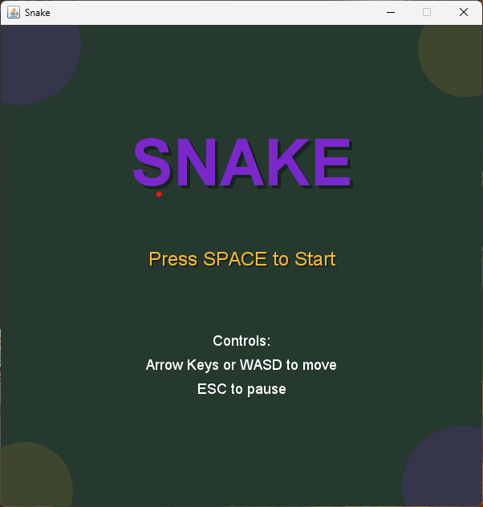
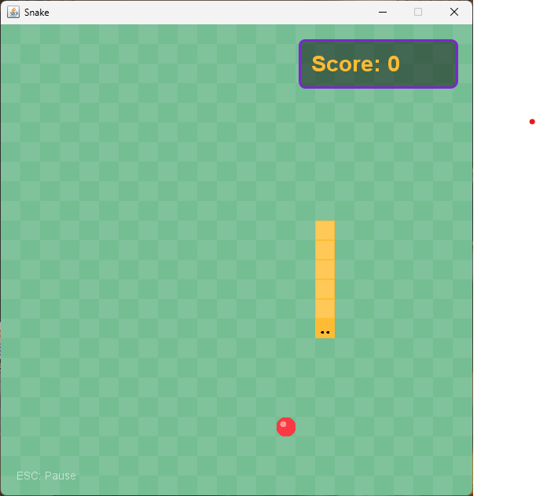

# Snake in Java

 

This is a simple Java implementation of the classic Snake game. The aim of the game is to control the snake as it moves around the screen, eating apples to grow longer while avoiding collisions with the walls and itself.

